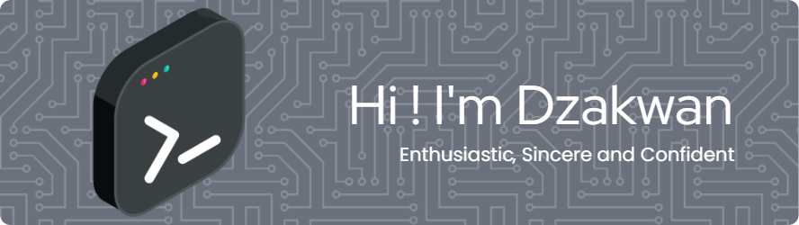

  

## 🚀 About Me
- 💼 Student in **STT Terpadu Nurul Fikri**
- 🔐 Lead of [NFSCC](https://www.instagram.com/nf.scc/) (Nurul Fikri Student Cyber Security Community)
- 💡 Passionate about **Cyber Security, Web Development, and Open Source**

<picture>
  <source media="(prefers-color-scheme: dark)" srcset="https://raw.githubusercontent.com/FirmansyahDzakwanArifien/FirmansyahDzakwanArifien/output/pacman-contribution-graph-dark.svg">
  <source media="(prefers-color-scheme: light)" srcset="https://raw.githubusercontent.com/FirmansyahDzakwanArifien/FirmansyahDzakwanArifien/output/pacman-contribution-graph.svg">
  
</picture>

###

#### 🧰 Tech Stack

           

## 🌱 Let's Connect!

 

---
