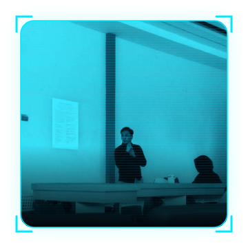

```bash
guest@github:~$ whoami
```

**Firmansyah Dzakwan Arifien** — Cybersecurity Enthusiast, Linux & SysAdmin.
Student at **STT Terpadu Nurul Fikri**, majoring in Information Technology, focused on cybersecurity, Linux, and system administration. Currently leading initiatives to build a stronger security-aware community among students.

<br clear="right"/>

```bash
guest@github:~$ neofetch --minimal
```

<div align="center">

```text
firmansyah@github
------------------
OS        : Linux (Daily Driver)
Role      : Implementation Engineer @ Jarvis Integrasi Solusi
Focus     : Cybersecurity · Linux SysAdmin · DevSecOps
Status    : Advisor @ NFSCC
Shell     : bash
Editor    : VS Code
```

</div>

```bash
guest@github:~$ ls -la core_competencies/
```

| Domain | Description |
|---|---|
| `cybersecurity/` | Security assessment, vulnerability analysis, ethical hacking |
| `sysadmin/` | Linux system administration & infrastructure management |
| `opensource/` | Contributing to and maintaining open-source projects |

```bash
guest@github:~$ ./tech_stack.sh
```

<div align="center">

[](https://skillicons.dev)

**Languages & Frameworks**
`JavaScript` `Python` `HTML/CSS` `Node.js` `Bash` `Laravel`

**Tools & Platforms**
`Linux` `Figma` `Git` `VS Code`

</div>

```bash
guest@github:~$ ./github_stats.sh --verbose
```

<div align="center">


</div>

```bash
guest@github:~$ tail -f current_focus.log
```

- `[+]` Deepening knowledge in penetration testing and security operations
- `[+]` Building secure and scalable web applications
- `[+]` Exploring cloud security and DevSecOps practices
- `[+]` Mentoring peers in cybersecurity fundamentals

```bash
guest@github:~$ ./connect.sh --social
```

<div align="center">

[](https://www.instagram.com/fdzak01/)
[](https://www.linkedin.com/in/firmansyah-dzakwan-arifien-90b1b8293)
[](https://github.com/FirmansyahDzakwanArifien)

</div>

<div align="center">


</div>

---

<div align="center">

```
"Security is not a product, but a process." — Bruce Schneier
```

*Feel free to explore my repositories and don't hesitate to reach out!*

</div>
