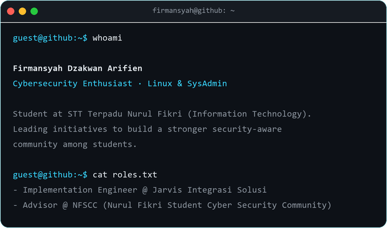
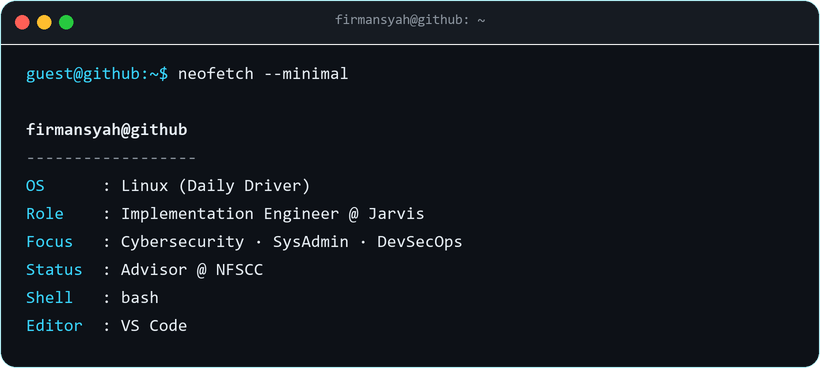
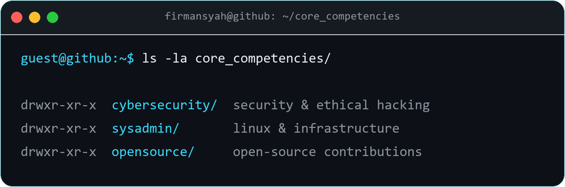
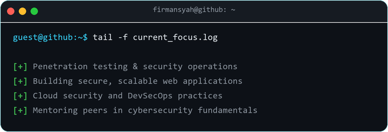

<br clear="right"/>

<div align="center">



<br/><br/>



</div>

```bash
guest@github:~$ ./resources.sh --download
```

<div align="center">

[](https://drive.google.com/file/d/19JzjPYVK4qW-3GnWa8cZ-GHP-8JlK5fz/view?usp=drive_link)
[](https://drive.google.com/file/d/1oU-sawtMXcT9KY9hnZ-yvS23YbUAoLKl/view?usp=drive_link)

</div>

```bash
guest@github:~$ ./tech_stack.sh
```

<div align="center">

[](https://skillicons.dev)

**Languages & Frameworks**
`JavaScript` `Python` `HTML/CSS` `Node.js` `Bash` `Laravel`

**Tools & Platforms**
`Linux` `Figma` `Git` `VS Code`

</div>

```bash
guest@github:~$ ./github_stats.sh --verbose
```

<div align="center">


</div>

<div align="center">



</div>

```bash
guest@github:~$ ./connect.sh --social
```

<div align="center">

[](https://www.instagram.com/fdzak01/)
[](https://www.linkedin.com/in/firmansyah-dzakwan-arifien-90b1b8293)
[](https://github.com/FirmansyahDzakwanArifien)

</div>

<div align="center">


</div>

---

<div align="center">

```
"Security is not a product, but a process." — Bruce Schneier
```

*Feel free to explore my repositories and don't hesitate to reach out!*

</div>
