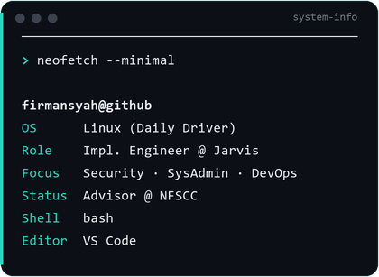
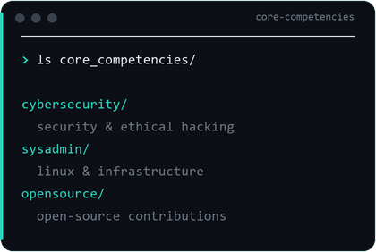
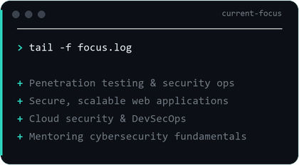

### Firmansyah Dzakwan Arifien

**Cybersecurity Enthusiast · Linux & SysAdmin**

Informatics Engineering student at **STT Terpadu Nurul Fikri** (expected graduation 2026), focused on cybersecurity, Linux, and system administration — with a growing research interest in User & Entity Behavior Analytics (UEBA) and machine learning for insider threat detection. Currently leading initiatives to build a stronger security-aware community among students.

- Implementation Engineer @ [PT. Jarvis Integrasi Solusi](https://jarvis.biz.id)
- Advisor @ [NF.CC](https://github.com/NFCC-Com) *(Nurul Fikri Student Cyber Security Community)*
- Infrastructure contributor @ [BlankOn Revival Project](https://www.blankonlinux.or.id/)

**Certified:** Fortinet Certified Associate in Cybersecurity · BNSP System Integrator · Certified DevOps Engineer (MBKM)

 

 

 

---

### System Info

&nbsp;&nbsp;

### Tech Stack

&nbsp;&nbsp;&nbsp;&nbsp;&nbsp;&nbsp;&nbsp;&nbsp;&nbsp;&nbsp;&nbsp;&nbsp;&nbsp;&nbsp;&nbsp;&nbsp;&nbsp;&nbsp;&nbsp;&nbsp;&nbsp;&nbsp;&nbsp;&nbsp;&nbsp;&nbsp;&nbsp;&nbsp;&nbsp;&nbsp;&nbsp;&nbsp;&nbsp;

### Current Focus & Activity

&nbsp;&nbsp;

### Connect

---

*"Security is not a product, but a process."* — Bruce Schneier

*Feel free to explore my repositories and don't hesitate to reach out!*

